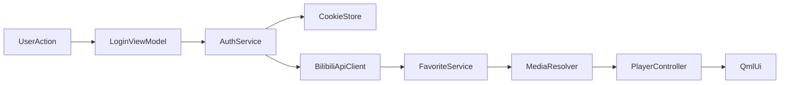

# 哔哩哔哩音乐客户端开发计划

## 项目现状
- 现有工程是一个最小化 `Qt Quick` 骨架，当前只有 [`D:/C++/cursor_music/CMakeLists.txt`](D:/C++/cursor_music/CMakeLists.txt) 和 [`D:/C++/cursor_music/main.cpp`](D:/C++/cursor_music/main.cpp) 两个核心构建/入口文件，UI 仍停留在 `Main.qml` 的初始窗口层面。
- 当前 `CMakeLists.txt` 已使用 `Qt6::Quick` 且 `qt_standard_project_setup(REQUIRES 6.8)`，结合你的构建截图，可按 `Qt 6.10.2 + MinGW 64-bit Debug` 继续推进；计划建议正式目标版本按 `Qt 6.5+` 编写，实际开发继续使用本机 `Qt 6.10.2`。
- 仓库内可直接复用的不是现成业务代码，而是 B站接口资料库，例如：
  - 登录态信息：[`D:/C++/cursor_music/哔哩哔哩API/bili-apis/docs/login/login_info.md`](D:/C++/cursor_music/哔哩哔哩API/bili-apis/docs/login/login_info.md)
  - Cookie 刷新：[`D:/C++/cursor_music/哔哩哔哩API/bili-apis/docs/login/cookie_refresh.md`](D:/C++/cursor_music/哔哩哔哩API/bili-apis/docs/login/cookie_refresh.md)
  - 音频流：[`D:/C++/cursor_music/哔哩哔哩API/bili-apis/docs/audio/musicstream_url.md`](D:/C++/cursor_music/哔哩哔哩API/bili-apis/docs/audio/musicstream_url.md)
  - 收藏夹信息：[`D:/C++/cursor_music/哔哩哔哩API/bili-apis/docs/fav/info.md`](D:/C++/cursor_music/哔哩哔哩API/bili-apis/docs/fav/info.md)
  - 收藏夹内容：[`D:/C++/cursor_music/哔哩哔哩API/bili-apis/docs/fav/list.md`](D:/C++/cursor_music/哔哩哔哩API/bili-apis/docs/fav/list.md)
- 代码库中目前未发现 `testLogin`、播放器、网络层、Cookie 管理、B站接口封装，因此“复用现有代码”的现实落点应调整为“复用现有 API 文档资料、保留现有 Qt 工程骨架，新增可复用基础模块”。

## 开发环境准备
### 1. 基础工具链
- 做什么：固定开发与构建基线，避免后续多端差异。
- 技术选型：
  - Qt：`Qt 6.5+`，建议继续使用本机 `Qt 6.10.2`
  - 编译器：Windows 优先 `MinGW 64-bit`；如后续考虑发布稳定性，可增配 `MSVC 2022`
  - C++ 标准：`C++17` 起步，保守稳定；若后续大量使用 `std::expected` 等能力，再升级到 `C++20`
  - 构建系统：`CMake 3.21+`（兼容 Qt 6 开发体验更好）
- 参考资源：现有构建配置截图、[`D:/C++/cursor_music/CMakeLists.txt`](D:/C++/cursor_music/CMakeLists.txt)
- 如何验证：可在 Qt Creator 中完成 `Debug` 构建，程序正常启动主窗口。

### 2. Qt 模块与第三方依赖清单
- 做什么：补齐实际功能所需依赖。
- 技术选型：
  - Qt 官方模块：`Quick`、`QuickControls2`、`Network`、`Multimedia`、`Svg`
  - JSON：优先使用 Qt 自带 `QJsonDocument/QJsonObject`，避免引入额外 JSON 库
  - Cookie/HTTP：优先 `QNetworkAccessManager + QNetworkCookieJar`
  - HTML 解析：若仅提取 `refresh_csrf`，可先用轻量字符串/正则解析；不急于引入 HTML 解析库
  - 音视频播放：
    - 第一优先：`QMediaPlayer + QAudioOutput + VideoOutput`
    - 备选：若 B站 DASH/编码兼容性不足，再评估 `libmpv` 或 `FFmpeg + 自绘渲染`
  - 持久化：`QSettings`（配置）+ `QSaveFile`（敏感 JSON 文件原子写入）
- 参考资源：Qt 官方模块文档、仓库内 B站 API 文档
- 如何验证：CMake 可成功链接所有模块，基础网络请求、音频播放 demo 能运行。

### 3. 目录与模块规划
- 做什么：在现有骨架上建立可扩展项目结构。
- 推荐结构：
  - `src/app`：应用启动、依赖装配
  - `src/network`：通用 HTTP 客户端、请求签名、CookieJar
  - `src/bilibili`：B站接口客户端与数据模型
  - `src/player`：播放控制、播放列表、媒体源解析
  - `src/ui` 或 `qml/pages`：主界面、登录页、收藏页、播放栏
  - `src/storage`：配置、登录态、缓存
  - `tests`：单元测试与接口模拟测试
- 如何验证：能按模块独立编译，避免后续把业务逻辑堆在 `main.cpp` 或单个 QML 文件里。

## 需求拆解
### 1. MVP 范围
- 做什么：限定个人开发首版必须完成的能力。
- 范围定义：
  - 支持获取 B站音乐区内容列表
  - 支持读取登录用户收藏夹列表与收藏夹内音频/视频内容
  - 支持音频播放与视频音频流播放
  - 支持基础播放控制：播放/暂停、进度条、拖动、音量
  - 支持网易云风格布局：左侧导航、中间内容区、底部播放栏
- 暂不做：倍速、歌词、弹幕、下载管理、复杂推荐系统、多端同步
- 如何验证：用户可完成登录、看到收藏夹内容、点击条目后稳定播放。

### 2. 功能拆分到模块
- `BilibiliApiClient`
  - 做什么：统一封装 GET/POST 请求、错误码处理、Cookie 透传、UA/Referer 设定。
  - 关键函数：`getNavInfo()`、`getFavoriteFolders(mid)`、`getFavoriteResources(mediaId, page)`、`getAudioStream(songId)`、`getVideoPlayUrl(bvid/cid)`
- `AuthService`
  - 做什么：登录态验证、Cookie 加载/保存、Cookie 刷新、退出登录。
  - 关键函数：`loadCookies()`、`saveCookies()`、`checkLogin()`、`refreshCookiesIfNeeded()`
- `CookieStore` / `PersistentCookieJar`
  - 做什么：把 `SESSDATA`、`bili_jct`、`DedeUserID`、`refresh_token` 持久化并安全读取。
- `FavoriteService`
  - 做什么：收藏夹列表与内容列表查询，区分音频/视频条目。
- `MediaResolver`
  - 做什么：把收藏条目转换为可播放 URL；音频与视频分流处理。
- `PlayerController`
  - 做什么：封装 `QMediaPlayer`、进度、音量、状态同步给 QML。
- `MainWindowViewModel` / `HomeViewModel` / `LoginViewModel`
  - 做什么：将 C++ 业务层暴露给 QML，避免 QML 内直接写复杂请求逻辑。

### 3. 关键数据流

## 分阶段开发计划
### 阶段一：基础框架搭建
- 阶段目标：完成可运行的项目骨架，打通 UI 壳、网络层、日志与配置存储。
- 核心开发任务：
  - 修改 [`D:/C++/cursor_music/CMakeLists.txt`](D:/C++/cursor_music/CMakeLists.txt)，补充 `Qt6::Network`、`Qt6::Multimedia`、`Qt6::QuickControls2` 等模块
  - 新建 `src/app/ApplicationContext`，集中管理服务实例
  - 实现 `src/network/HttpClient`，统一超时、Header、错误处理
  - 实现 `src/storage/PersistentCookieJar` 和 `src/storage/AppSettings`
  - 重构 `Main.qml` 为三段式布局：左导航、中内容、底部播放栏
  - 建立基础页面：`HomePage.qml`、`FavoritesPage.qml`、`LoginPage.qml`
- 依赖资源：
  - Qt 文档
  - 现有 Qt 工程入口 [`D:/C++/cursor_music/main.cpp`](D:/C++/cursor_music/main.cpp)
- 预估耗时：`3-5 天`
- 验收标准：
  - 应用可启动并切换页面
  - 本地配置可写入/读取
  - 通用 HTTP 请求类可成功请求一个公开接口

### 阶段二：核心功能开发
- 阶段目标：打通登录态、收藏夹读取、播放链接解析与基础播放闭环。
- 核心开发任务：
  - 实现 `src/bilibili/BilibiliApiClient`
  - 实现 `src/auth/AuthService`
    - `checkLogin()` 对接 `x/web-interface/nav`
    - `refreshCookiesIfNeeded()` 参考 [`login_info.md`](D:/C++/cursor_music/哔哩哔哩API/bili-apis/docs/login/login_info.md) 与 [`cookie_refresh.md`](D:/C++/cursor_music/哔哩哔哩API/bili-apis/docs/login/cookie_refresh.md)
  - 实现 `src/bilibili/FavoriteService`
    - 获取收藏夹元数据：[`fav/info.md`](D:/C++/cursor_music/哔哩哔哩API/bili-apis/docs/fav/info.md)
    - 获取收藏夹内容：[`fav/list.md`](D:/C++/cursor_music/哔哩哔哩API/bili-apis/docs/fav/list.md)
  - 实现 `src/player/MediaResolver`
    - 音频流优先对接 [`musicstream_url.md`](D:/C++/cursor_music/哔哩哔哩API/bili-apis/docs/audio/musicstream_url.md)
    - 视频播放地址优先使用仓库内 `docs/video/videostream_url.md` 设计封装
  - 实现 `src/player/PlayerController`
    - 封装播放、暂停、seek、音量、播放状态、错误回调
  - 实现 `LoginWidget` 或 `LoginPage.qml`
    - 首版建议支持“导入 Cookie 登录”优先，扫码登录作为增强项
- 依赖资源：
  - [`D:/C++/cursor_music/哔哩哔哩API/bili-apis/docs/login/login_info.md`](D:/C++/cursor_music/哔哩哔哩API/bili-apis/docs/login/login_info.md)
  - [`D:/C++/cursor_music/哔哩哔哩API/bili-apis/docs/login/cookie_refresh.md`](D:/C++/cursor_music/哔哩哔哩API/bili-apis/docs/login/cookie_refresh.md)
  - [`D:/C++/cursor_music/哔哩哔哩API/bili-apis/docs/fav/info.md`](D:/C++/cursor_music/哔哩哔哩API/bili-apis/docs/fav/info.md)
  - [`D:/C++/cursor_music/哔哩哔哩API/bili-apis/docs/fav/list.md`](D:/C++/cursor_music/哔哩哔哩API/bili-apis/docs/fav/list.md)
  - [`D:/C++/cursor_music/哔哩哔哩API/bili-apis/docs/audio/musicstream_url.md`](D:/C++/cursor_music/哔哩哔哩API/bili-apis/docs/audio/musicstream_url.md)
- 预估耗时：`7-10 天`
- 验收标准：
  - 导入有效 Cookie 后可识别登录用户
  - 可展示至少一个收藏夹与其内容列表
  - 点击音频/视频条目后可稳定播放音频流
  - 底部播放栏的播放/暂停、进度拖动、音量控制可用

### 阶段三：UI 美化与交互优化
- 阶段目标：将界面调整到“网易云风格相似、操作流畅”的可用状态。
- 核心开发任务：
  - 实现左侧导航栏：推荐、收藏、最近播放、登录信息区
  - 实现中间内容区卡片化列表：封面、标题、UP 主、时长
  - 实现底部播放栏：封面、标题、进度条、音量、状态图标
  - 统一主题样式：深色背景、红色强调色、圆角卡片、悬停反馈
  - 实现骨架屏/加载中/错误态/空列表态
  - 增加最近播放记录与简单播放队列
- 技术方案：
  - UI 层使用 `Qt Quick Controls 2 + 自定义 QML 组件`
  - 主题色、字号、间距集中到 `Theme.qml` 或单独样式单例
  - 业务状态通过 `Q_PROPERTY` 或 `QAbstractListModel` 暴露给 QML
- 依赖资源：网易云音乐桌面端布局参考、现有 QML 主窗口结构
- 预估耗时：`4-6 天`
- 验收标准：
  - 首页、收藏页、播放栏视觉统一
  - 交互切换无明显卡顿
  - 主要状态都有明确反馈，不出现空白页面

### 阶段四：测试与联调
- 阶段目标：提高基础稳定性，完成 Windows 优先场景下的功能验收。
- 核心开发任务：
  - 为 `AuthService`、`FavoriteService`、`MediaResolver` 增加单元测试
  - 为 `PersistentCookieJar` 增加持久化与恢复测试
  - 构造 mock JSON，覆盖接口返回字段缺失、未登录、403、资源失效等场景
  - 手工联调真实 Cookie 与收藏夹数据
  - 验证多类媒体：普通音频、收藏夹视频、无权限资源、失效资源
  - Windows 打包与运行回归；Linux 仅做编译兼容性检查
- 技术方案：
  - 测试框架优先 `Qt Test`
  - 网络层测试采用“本地 JSON fixture + mock reply”方式，避免测试依赖线上接口稳定性
- 依赖资源：真实测试账号 Cookie、若干收藏夹样例数据
- 预估耗时：`3-4 天`
- 验收标准：
  - 核心服务有基础单测覆盖
  - 登录、收藏夹读取、播放链路通过手工回归
  - Windows 平台可稳定启动并连续播放多条资源

## 技术难点与解决方案
### 1. B站 API 鉴权与登录态维护
- 难点：Cookie 登录可用，但失效、刷新、风控流程复杂。
- 解决方案：
  - 首版采用“用户手动导入 Cookie”作为最稳妥路径
  - 登录态判断先用 `x/web-interface/nav`
  - Cookie 刷新严格按 [`cookie_refresh.md`](D:/C++/cursor_music/哔哩哔哩API/bili-apis/docs/login/cookie_refresh.md) 的步骤实现，但作为二阶段增强，不阻塞 MVP
  - 敏感信息仅本地保存，不上传、不打印完整日志
- 如何验证：有效 Cookie 能读到用户信息；无效 Cookie 能正确提示重新登录。

### 2. 音视频流播放稳定性
- 难点：B站资源可能是短时效 URL、DASH、分离音视频流，Qt Multimedia 对部分编码兼容性不稳定。
- 解决方案：
  - MVP 优先保证“音频可稳定播放”，优先支持音频流与视频音频轨播放
  - 播放器第一版只做单媒体源播放，不一开始就处理复杂 DASH 合流
  - 若 `QMediaPlayer` 对某些链接兼容性差，再引入 `libmpv` 作为第二阶段替代方案，而不是一开始增加复杂度
- 如何验证：连续播放 10+ 条不同来源资源，观察是否出现黑屏、无声、seek 失败。

### 3. UI 仿网易云风格但不过度复杂
- 难点：个人开发如果追求 1:1 还原，容易拖慢主功能进度。
- 解决方案：
  - 只还原“三栏布局 + 深色主题 + 红色强调 + 卡片列表 + 底部播放栏”这几个识别度最高的元素
  - 控件尽量用 QML 组件化复用，不在早期引入过度动画
- 如何验证：界面整体风格接近目标产品，主要交互流畅清晰。

### 4. 跨平台兼容
- 难点：Windows 与 Linux 的多媒体后端行为不同。
- 解决方案：
  - Windows 作为第一目标平台，先在本机 Qt Creator + MinGW 验证完整能力
  - 避免写死 Windows 路径；配置、缓存统一用 `QStandardPaths`
  - Linux 仅在后期做编译与基础播放验证，不作为首版阻塞项
- 如何验证：Windows 功能完整；Linux 至少可以成功编译并启动。

## 测试计划
### 1. 单元测试
- 测试对象：`AuthService`、`BilibiliApiClient` 的响应解析、`PersistentCookieJar`、`PlayerController` 的状态同步
- 做什么：验证 JSON 解析、Cookie 读写、错误码处理、播放状态切换
- 如何验证：`Qt Test` 测试全部通过

### 2. 接口模拟测试
- 做什么：为登录成功、未登录、403、收藏夹空数据、资源失效构建本地 fixture
- 用什么技术：本地 JSON 文件 + mock reply
- 如何验证：关键分支都有稳定可重现测试

### 3. 手工功能测试
- 用例：
  - 导入 Cookie 并识别登录用户
  - 读取收藏夹列表
  - 读取收藏夹中的音频/视频条目
  - 点击播放、暂停、拖动进度、调节音量
  - 资源失效时弹出提示而不是卡死
- 如何验证：按用例表逐项勾验

### 4. 兼容性与回归
- 做什么：每个阶段结束前做一次 Windows 回归
- 关注项：启动性能、内存占用、连续切换播放、网络异常恢复
- 如何验证：连续 30 分钟使用不崩溃、主要功能可重复执行

## 进度里程碑
- 第 1 周：完成环境整理、模块骨架、三栏式 UI 外壳、通用 HTTP 客户端
- 第 2 周：完成 Cookie 导入登录、登录态校验、收藏夹列表读取
- 第 3 周：完成收藏夹内容展示、音频流解析、基础播放器闭环
- 第 4 周：完成 UI 美化、错误态处理、基础测试与联调
- MVP 里程碑：用户能在 Windows 上打开客户端、导入 B站登录态、浏览收藏夹、点击并稳定播放音频/视频资源的音频内容

## 现有代码/资源复用策略
- 直接复用现有工程骨架：[`D:/C++/cursor_music/CMakeLists.txt`](D:/C++/cursor_music/CMakeLists.txt)、[`D:/C++/cursor_music/main.cpp`](D:/C++/cursor_music/main.cpp)
- 直接复用仓库中的 B站 API 文档作为开发依据，而不是重新查找接口
- 由于仓库中未发现 `testLogin` 代码，本计划将“Cookie 获取逻辑封装复用”替换为“新增 `AuthService + PersistentCookieJar` 作为后续所有模块共用基础设施”
- 后续如果你另有本地未提交的 `testLogin` 分支/文件，可把该逻辑并入 `AuthService`，优先提取为：
  - `parseCookieString()`
  - `saveCookies()`
  - `checkLogin()`
  - `refreshCookiesIfNeeded()`

## 实施建议
- 个人开发场景下，建议先做“Cookie 导入登录 + 收藏夹读取 + 音频播放”这条最短闭环，再做扫码登录与视频完整播放。
- 如果你希望尽快进入编码，第一批落地文件可以优先集中在：
  - [`D:/C++/cursor_music/CMakeLists.txt`](D:/C++/cursor_music/CMakeLists.txt)
  - `src/network/HttpClient.*`
  - `src/auth/AuthService.*`
  - `src/storage/PersistentCookieJar.*`
  - `qml/MainWindow.qml`
  - `qml/pages/FavoritesPage.qml`
  - `src/player/PlayerController.*`
